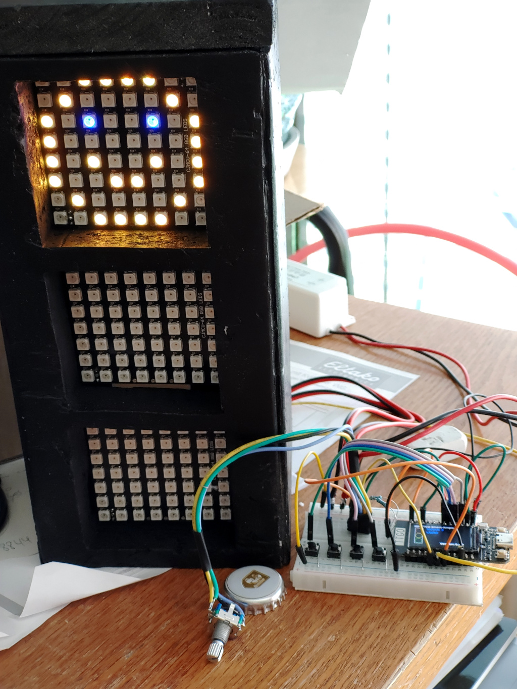
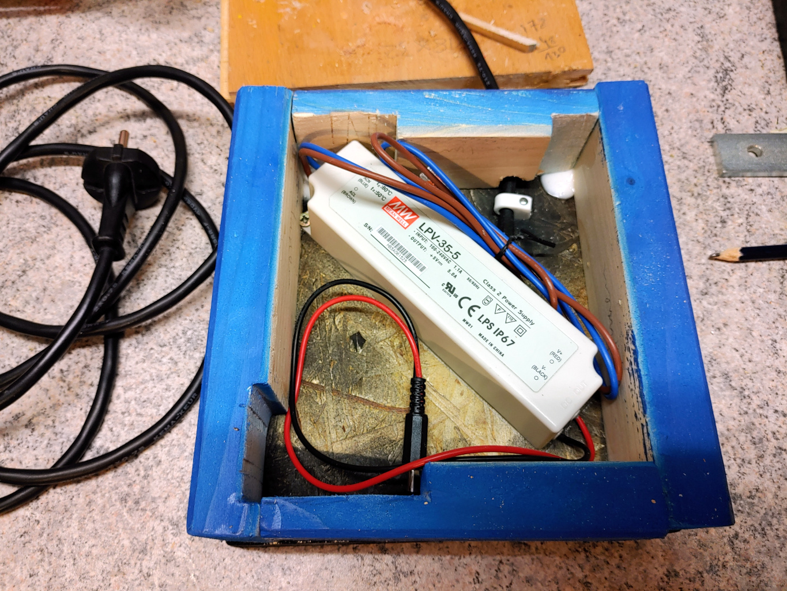
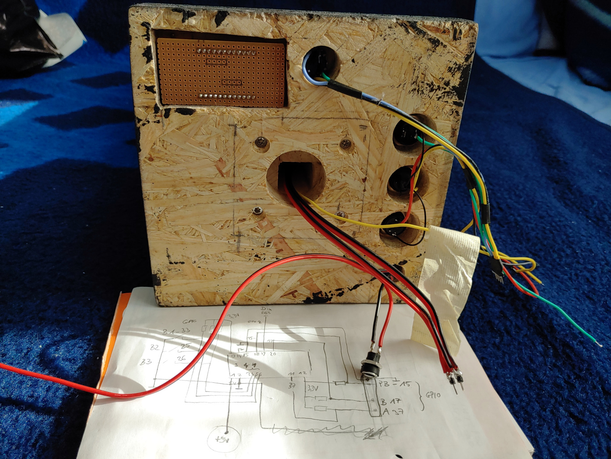
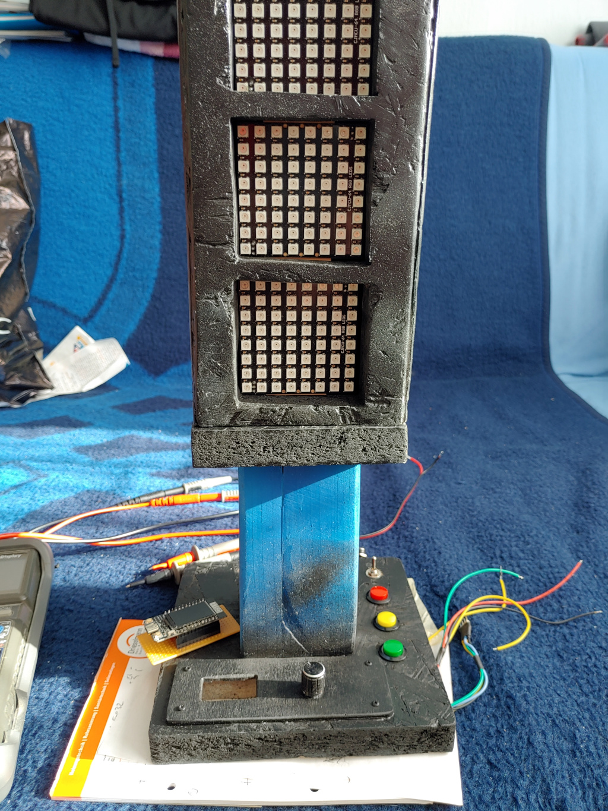
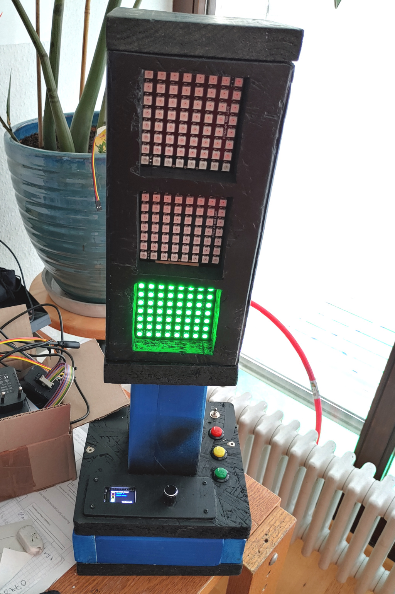

# ESP32_TTGO_Smart-Traffic-Light
arduino sample sketch for ESP32 (here: LILYGO TTGO-T w. color oled) to control three 8x8 RGB-Led matrices (WS2812B)

# Current Hardware:
* MCU Espressif ESP32 LILYGO TTGO-T Color Display (https://www.banggood.com/de/LILYGO-TTGO-T-Display-ESP32-CP2104-WiFi-bluetooth-Module-1_14-Inch-LCD-Development-Board-p-1522925.html)
* 3 x 8*8 RGB-Led Matrix (WS2812B https://www.aliexpress.com/item/32825073247.html?spm=a2g0s.9042311.0.0.27424c4dYEJDNZ)
* 3 Input Buttons (push-button) internal pull-ups working
* 1 rotary encoder switch (w/push-button) with external pull-ups (10k) ... could not get proper signal with internal pull-up (at least not on gpio37, gpio17)
* Note on Power Supply, we have 192 RGB-Leds which can draw a specified max. current of 60mA per pixel! So driving all LEDs white at full brightness would lead to 192 * 0.06A = 11.5A (!). As you can see in one of the images I'm using a 5A rated power supply, but the sample code does not use white color and limits brightness ... but this could lead to trouble in case of sw or hw bugs!

## LED Martix Arrangement
                  Din
     _ _ _ _ _ _ _ _
    |_|_|_|_|_|_|_|_| 0 TOP
    |_|_|_|_|_|_|_|_|
    |_|_|_|_|_|_|_|_|
    |_|_|_|_|_|_|_|_|
    |_|_|_|_|_|_|_|_|
    |_|_|_|_|_|_|_|_|
    |_|_|_|_|_|_|_|_|
    |_|_|_|_|_|_|_|_| 7
     _ _ _ _ _ _ _ _
    |_|_|_|_|_|_|_|_|64 MIDDLE
    |_|_|_|_|_|_|_|_|
    |_|_|_|_|_|_|_|_|
    |_|_|_|_|_|_|_|_|
    |_|_|_|_|_|_|_|_|
    |_|_|_|_|_|_|_|_|
    |_|_|_|_|_|_|_|_|
    |_|_|_|_|_|_|_|_|71
     _ _ _ _ _ _ _ _
    |_|_|_|_|_|_|_|_|128 BOTTOM
    |_|_|_|_|_|_|_|_|
    |_|_|_|_|_|_|_|_|
    |_|_|_|_|_|_|_|_|
    |_|_|_|_|_|_|_|_|
    |_|_|_|_|_|_|_|_|
    |_|_|_|_|_|_|_|_|
    |_|_|_|_|_|_|_|_|135

# Requirements / Dependencies
* <FastLED.h>
* <TFT_eSPI.h>
* <Button2.h>
* <PubSubClient.h>
* <Rotary.h>
* <NTPClient.h> NOTE: this is required to get day and month  https://github.com/arduino-libraries/NTPClient/pull/94, you can clone from here: https://github.com/lefty01/NTPClient

# Features / Ideas
Initial idea was to have kind of a "busy" or "on-air" signal while working at home, for example show red light while in a web conference.
Basically its just another toy project to experiment with this ESP32 module and mqtt/tls, ...
Since the kids needed some traffic light as well it features some automatic mode to cycle through red-red/yellow-green-yellow sequence.
Other ideas are some kind of mood light or "disco" mode, to light up LEDs at random pattern. Or trigger patterns via mqtt command.
OTA is now working and makes use of the LEDs to indicate update progress.
## OTA
Issue: OTA failed: no response from device
Fix:   firewall rules
       $ sudo iptables -I INPUT  -s 192.168.1.123 -j ACCEPT
       $ sudo iptables -I OUTPUT -d 192.168.1.123 -j ACCEPT

# Menu Control

# FIXMEs/TODOs/Improvements
* checkout https://jorgen-vikinggod.github.io/LEDMatrix/
* checkout https://xantorohara.github.io/led-matrix-editor/
* misc refactoring ...

# Pictures

